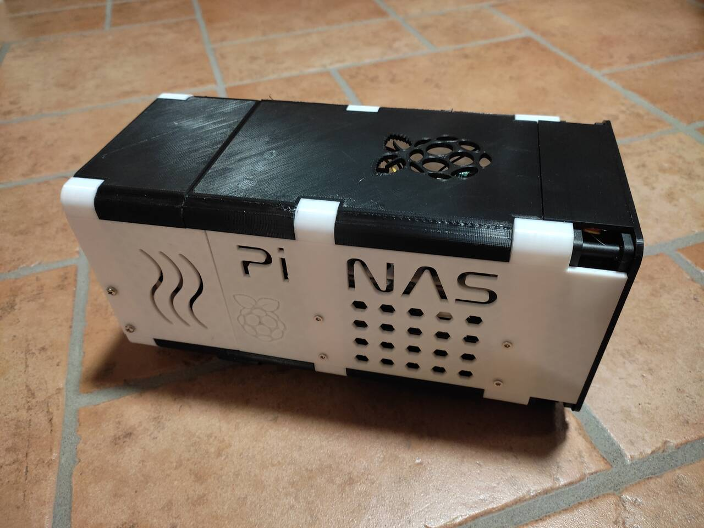
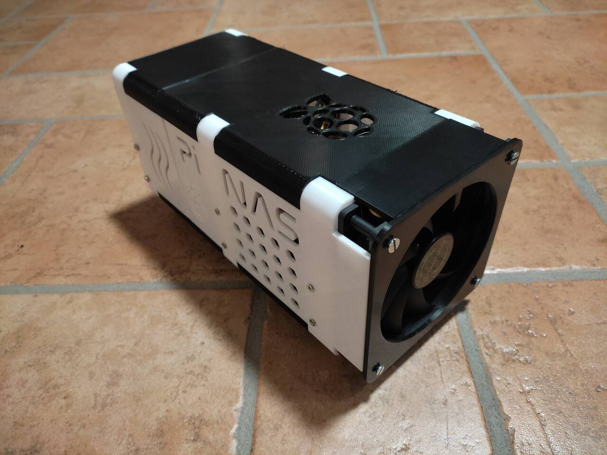
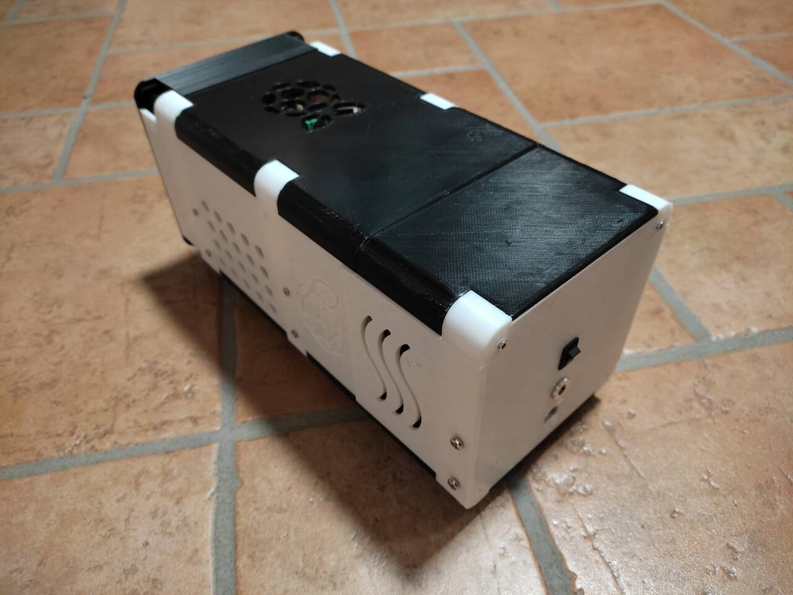

# PiNAS

## Description

PiNAS is a 3D printed compact NAS enclosure based on Raspberry Pi and up to two SATA HDD/SSD units connected to the Raspberry Pi via SATA to USB converter.

Software-wise it runs on Raspbian and Samba/FTP/anything you like. Power supply can be provided using a 12V 5A external PSU that will power the +12V lines of HDD/SSD drives.
+5V power supply can be provided using a small buck converter such as the DC DC Step Down MP1584 that can provide up to 3A of current, enough to power the Raspberry Pi and the two disk units.

## 3D components

All parts should be printed using:

- PLA filament
- 3 walls
- 0.1mm layer height
- 15% infill
- print plate adhesion raft if needed

The 'Raspberry Pi 2 plate.stl' model is suitable for a Raspberry Pi 2. A Raspberry Pi 4 version will be added here soon.

## Additional hardware needed

- 120x120x25mm PC fan (ie. https://www.aliexpress.com/item/1005002404506907.html)
- female-to-female RJ45 back-to-back adapter (ie. https://www.aliexpress.com/item/4000204295845.html)
- External mains to +12V 5A power supply unit (ie. https://www.aliexpress.com/item/4000859284925.html)
- 5.5 mm x 2.1mm DC Power Jack Socket (ie. https://www.aliexpress.com/item/32902615756.html)
- Up to two SATA to USB adapters (ie. https://www.aliexpress.com/item/1005003156749957.html)
- MP1584EN DC-DC Converter Step Down Voltage Regulator Module (ie. https://www.aliexpress.com/item/4000016331112.html)
- On-off switch (ie. https://www.aliexpress.com/item/32869269215.html)
- M3 and M4 screws
- SATA power and data cables
- Up to two 3.5" HDD/SSD units
- Raspberry Pi 2/3/4
- Cat 5/6 cable

## Complete build

